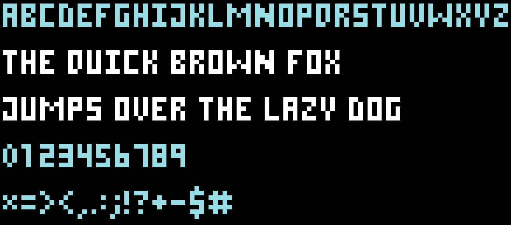

# Code-Generated SVG PX Font




Use the `write` function to translate text to an SVG component:
```js
write('abcdefghijklmnopqrstuvwxyz')
```

The `write` function receives up to three arguments:
- `string` Your text (required)
- `string` The text color (optional)
- `number` The letter spacing in PX (optional)

You can use the assembled string as part of an SVG:
```js
const SVG = `<svg width="1400" height="600">
  <g transform="scale(10)">
    ${write('The quick brown fox', 'white')}
  </g>
  <g transform="scale(10) translate(0, 10)">
    ${write('jumps over the lazy dog.', 'white')}
  </g>
</svg>`
```
